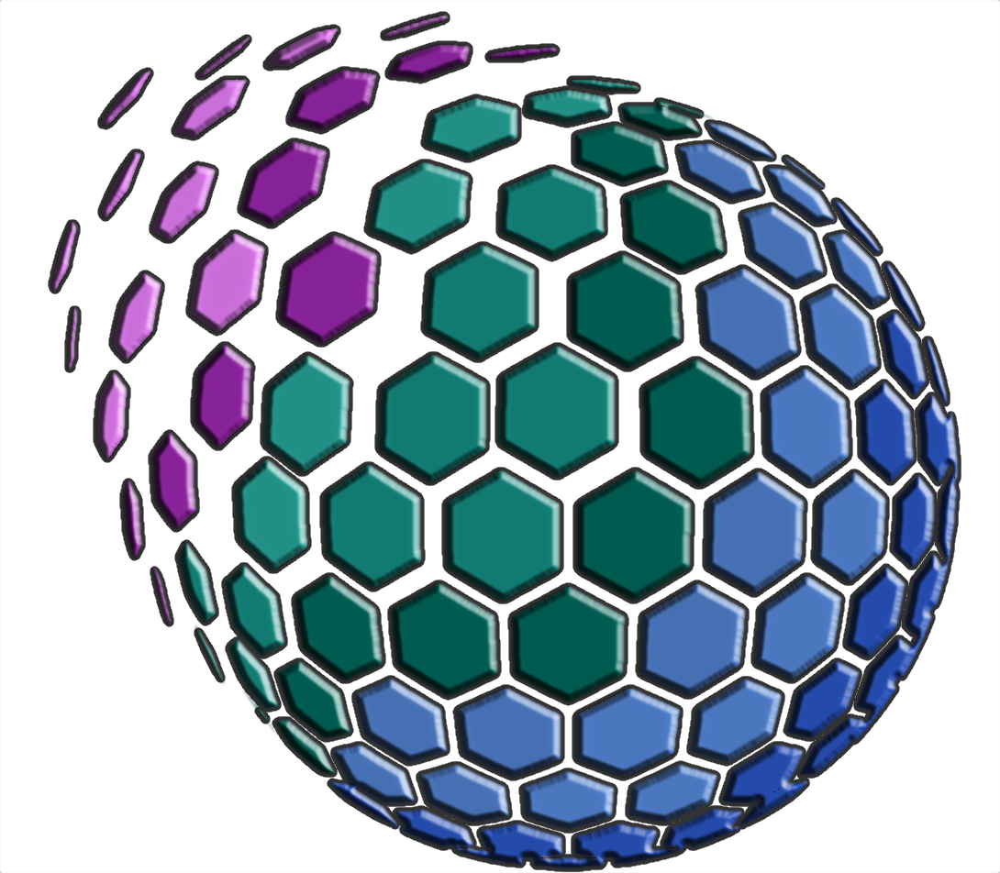
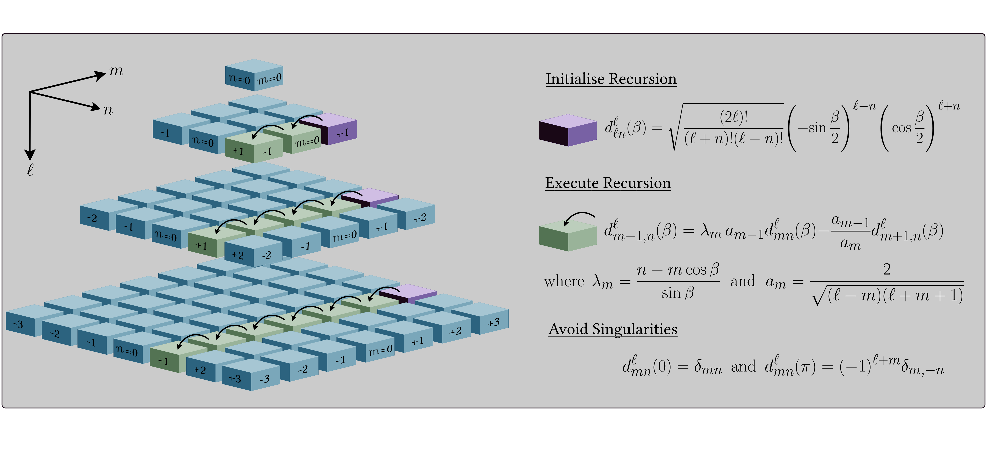
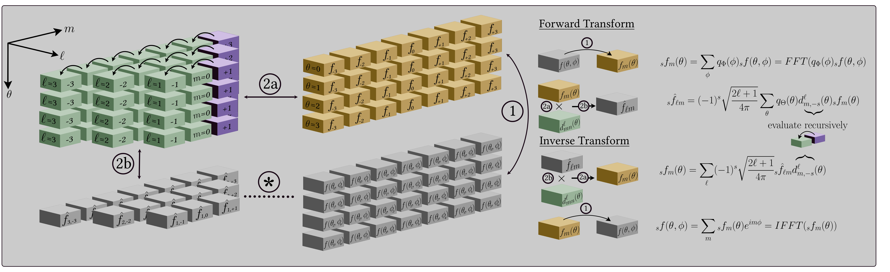

[](https://github.com/astro-informatics/s2fft/actions/workflows/tests.yml)
[](https://codecov.io/gh/astro-informatics/s2fft)
[](https://opensource.org/licenses/MIT)
[](https://badge.fury.io/py/s2fft)
[](https://arxiv.org/abs/2311.14670)<!-- ALL-CONTRIBUTORS-BADGE:START - Do not remove or modify this section -->
[](#contributors-) <!-- ALL-CONTRIBUTORS-BADGE:END --> 
[](https://colab.research.google.com/drive/1YmJ2ljsF8HBvhPmD4hrYPlyAKc4WPUgq?usp=sharing)
<!-- [](https://github.com/psf/black) -->



# Differentiable and accelerated spherical transforms with JAX

`S2FFT` is a JAX package for computing Fourier transforms on the sphere
and rotation group [(Price & McEwen 2023)](https://arxiv.org/abs/2311.14670). It leverages autodiff to provide differentiable
transforms, which are also deployable on hardware accelerators
(e.g. GPUs and TPUs).

More specifically, `S2FFT` provides support for spin spherical harmonic
and Wigner transforms (for both real and complex signals), with support
for adjoint transformations where needed, and comes with different
optimisations (precompute or not) that one may select depending on
available resources and desired angular resolution $L$.

## Algorithms :zap:

`S2FFT` leverages new algorithmic structures that can he highly
parallelised and distributed, and so map very well onto the architecture
of hardware accelerators (i.e. GPUs and TPUs). In particular, these
algorithms are based on new Wigner-d recursions that are stable to high
angular resolution $L$. The diagram below illustrates the recursions
(for further details see Price & McEwen, in prep.).


With this recursion to hand, the spherical harmonic coefficients of an 
isolatitudinally sampled map may be computed as a two step process. First, 
a 1D Fourier transform over longitude, for each latitudinal ring. Second, 
a projection onto the real polar-d functions. One may precompute and store 
all real polar-d functions for extreme acceleration, however this comes 
with an equally extreme memory overhead, which is infeasible at L ~ 1024. 
Alternatively, the real polar-d functions may calculated recursively, 
computing only a portion of the projection at a time, hence incurring 
negligible memory overhead at the cost of slightly slower execution. The 
diagram below illustrates the separable spherical harmonic transform 
(for further details see Price & McEwen, in prep.).



## Sampling :earth_africa:

The structure of the algorithms implemented in `S2FFT` can support any
isolattitude sampling scheme. A number of sampling schemes are currently
supported.

The equiangular sampling schemes of [McEwen & Wiaux
(2012)](https://arxiv.org/abs/1110.6298) and [Driscoll & Healy
(1995)](https://www.sciencedirect.com/science/article/pii/S0196885884710086)
are supported, which exhibit associated sampling theorems and so
harmonic transforms can be computed to machine precision. Note that the
McEwen & Wiaux sampling theorem reduces the Nyquist rate on the sphere
by a factor of two compared to the Driscoll & Healy approach, halving
the number of spherical samples required.

The popular [HEALPix](https://healpix.jpl.nasa.gov) sampling scheme
([Gorski et al. 2005](https://arxiv.org/abs/astro-ph/0409513)) is also
supported. The HEALPix sampling does not exhibit a sampling theorem and
so the corresponding harmonic transforms do not achieve machine
precision but exhibit some error. However, the HEALPix sampling provides
pixels of equal areas, which has many practical advantages.

<p align="center"></p>

> [!NOTE]  
> For algorithmic reasons JIT compilation of HEALPix transforms can become slow at high bandlimits, due to XLA unfolding of loops which currently cannot be avoided. After compiling HEALPix transforms should execute with the efficiency outlined in the associated paper, therefore this additional time overhead need only be incurred once. We are aware of this issue and will work to improve this in subsequent versions.

## Installation :computer:

The Python dependencies for the `S2FFT` package are listed in the file
`requirements/requirements-core.txt` and will be automatically installed
into the active python environment by [pip](https://pypi.org) when running

``` bash
pip install .        
```

from the root directory of the repository. Unit tests can then be
executed to ensure the installation was successful by running

``` bash
pytest tests/  
```

Alternatively, the `S2FFT` package may be installed directly from PyPi by running 

``` bash
pip install s2fft
```

> [!NOTE]  
> For plotting functionality which can be found throughout our various notebooks, one must install the requirements which can be found in `requirements/requirements-plotting.txt`.

## Usage :rocket:

To import and use `S2FFT` is as simple follows:

For a signal on the sphere

``` python
# Compute harmonic coefficients
flm = s2fft.forward_jax(f, L)  
# Map back to pixel-space signal
f = s2fft.inverse_jax(flm, L)
```

For a signal on the rotation group 

``` python
# Compute Wigner coefficients
flmn = s2fft.wigner.forward_jax(f, L, N)
# Map back to pixel-space signal
f = fft.wigner.inverse_jax(flmn, L, N)
```

For further details on usage see the [documentation](https://astro-informatics.github.io/s2fft/) and associated [notebooks](https://astro-informatics.github.io/s2fft/tutorials/spherical_harmonic/spherical_harmonic_transform.html).

## Benchmarking :hourglass_flowing_sand:

We benchmarked the spherical harmonic and Wigner transforms implemented
in `S2FFT` against the C implementations in the
[SSHT](https://github.com/astro-informatics/ssht) package.

A brief summary is shown in the table below for the recursion (left) and
precompute (right) algorithms, with `S2FFT` running on GPUs (for further
details see Price & McEwen, in prep.). Note that our compute time is
agnostic to spin number (which is not the case for many other methods
that scale linearly with spin).

| L    | Wall-Time | Speed-up | Error    | Wall-Time | Speed-up | Error    | Memory  |
|------|-----------|----------|----------|-----------|----------|----------|---------|
| 64   | 3.6 ms    | 0.88     | 1.81E-15 | 52.4 μs   | 60.5     | 1.67E-15 | 4.2 MB  |
| 128  | 7.26 ms   | 1.80     | 3.32E-15 | 162 μs    | 80.5     | 3.64E-15 | 33 MB   |
| 256  | 17.3 ms   | 6.32     | 6.66E-15 | 669 μs    | 163      | 6.74E-15 | 268 MB  |
| 512  | 58.3 ms   | 11.4     | 1.43E-14 | 3.6 ms    | 184      | 1.37E-14 | 2.14 GB |
| 1024 | 194 ms    | 32.9     | 2.69E-14 | 32.6 ms   | 195      | 2.47E-14 | 17.1 GB |
| 2048 | 1.44 s    | 49.7     | 5.17E-14 | N/A       | N/A      | N/A      | N/A     |
| 4096 | 8.48 s    | 133.9    | 1.06E-13 | N/A       | N/A      | N/A      | N/A     |
| 8192 | 82 s      | 110.8    | 2.14E-13 | N/A       | N/A      | N/A      | N/A     |

where the left hand results are for the recursive based algorithm and the right hand side are 
our precompute implementation.

## Contributors ✨

Thanks goes to these wonderful people ([emoji
key](https://allcontributors.org/docs/en/emoji-key)):
<!-- ALL-CONTRIBUTORS-LIST:START - Do not remove or modify this section -->
<!-- prettier-ignore-start -->
<!-- markdownlint-disable -->
<table>
  <tbody>
    <tr>
      <td align="center" valign="top" width="14.28%"><a href="https://cosmomatt.github.io"><br /><sub><b>Matt Price</b></sub></a><br /><a href="https://github.com/astro-informatics/s2fft/commits?author=CosmoMatt" title="Code">💻</a> <a href="https://github.com/astro-informatics/s2fft/pulls?q=is%3Apr+reviewed-by%3ACosmoMatt" title="Reviewed Pull Requests">👀</a> <a href="#ideas-CosmoMatt" title="Ideas, Planning, & Feedback">🤔</a></td>
      <td align="center" valign="top" width="14.28%"><a href="http://www.jasonmcewen.org"><br /><sub><b>Jason McEwen </b></sub></a><br /><a href="https://github.com/astro-informatics/s2fft/commits?author=jasonmcewen" title="Code">💻</a> <a href="https://github.com/astro-informatics/s2fft/pulls?q=is%3Apr+reviewed-by%3Ajasonmcewen" title="Reviewed Pull Requests">👀</a> <a href="#ideas-jasonmcewen" title="Ideas, Planning, & Feedback">🤔</a></td>
      <td align="center" valign="top" width="14.28%"><a href="http://matt-graham.github.io"><br /><sub><b>Matt Graham</b></sub></a><br /><a href="https://github.com/astro-informatics/s2fft/commits?author=matt-graham" title="Code">💻</a> <a href="https://github.com/astro-informatics/s2fft/pulls?q=is%3Apr+reviewed-by%3Amatt-graham" title="Reviewed Pull Requests">👀</a></td>
      <td align="center" valign="top" width="14.28%"><a href="https://sfmig.github.io/"><br /><sub><b>sfmig</b></sub></a><br /><a href="https://github.com/astro-informatics/s2fft/commits?author=sfmig" title="Code">💻</a> <a href="https://github.com/astro-informatics/s2fft/pulls?q=is%3Apr+reviewed-by%3Asfmig" title="Reviewed Pull Requests">👀</a></td>
      <td align="center" valign="top" width="14.28%"><a href="https://github.com/Devaraj-G"><br /><sub><b>Devaraj Gopinathan</b></sub></a><br /><a href="https://github.com/astro-informatics/s2fft/commits?author=Devaraj-G" title="Code">💻</a></td>
      <td align="center" valign="top" width="14.28%"><a href="http://flanusse.net"><br /><sub><b>Francois Lanusse</b></sub></a><br /><a href="https://github.com/astro-informatics/s2fft/commits?author=EiffL" title="Code">💻</a> <a href="https://github.com/astro-informatics/s2fft/issues?q=author%3AEiffL" title="Bug reports">🐛</a></td>
    </tr>
  </tbody>
</table>

<!-- markdownlint-restore -->
<!-- prettier-ignore-end -->

<!-- ALL-CONTRIBUTORS-LIST:END -->
We encourage contributions from any interested developers. A simple
first addition could be adding support for more spherical sampling
patterns!

## Attribution :books: 

Should this code be used in any way, we kindly request that the following article is
referenced. A BibTeX entry for this reference may look like:

``` 
@article{price:s2fft, 
   author      = "Matthew A. Price and Jason D. McEwen",
   title       = "Differentiable and accelerated spherical harmonic and Wigner transforms",
   journal     = "Journal of Computational Physics, submitted",
   year        = "2023",
   eprint      = "arXiv:2311.14670"        
}
```

You might also like to consider citing our related papers on which this
code builds:

``` 
@article{mcewen:fssht,
    author      = "Jason D. McEwen and Yves Wiaux",
    title       = "A novel sampling theorem on the sphere",
    journal     = "IEEE Trans. Sig. Proc.",
    year        = "2011",
    volume      = "59",
    number      = "12",
    pages       = "5876--5887",        
    eprint      = "arXiv:1110.6298",
    doi         = "10.1109/TSP.2011.2166394"
}
```

``` 
@article{mcewen:so3,
    author      = "Jason D. McEwen and Martin B{\"u}ttner and Boris ~Leistedt and Hiranya V. Peiris and Yves Wiaux",
    title       = "A novel sampling theorem on the rotation group",
    journal     = "IEEE Sig. Proc. Let.",
    year        = "2015",
    volume      = "22",
    number      = "12",
    pages       = "2425--2429",
    eprint      = "arXiv:1508.03101",
    doi         = "10.1109/LSP.2015.2490676"    
}
```

## License :memo:

We provide this code under an MIT open-source licence with the hope that
it will be of use to a wider community.

Copyright 2023 Matthew Price, Jason McEwen and contributors.

`S2FFT` is free software made available under the MIT License. For
details see the LICENSE file.
