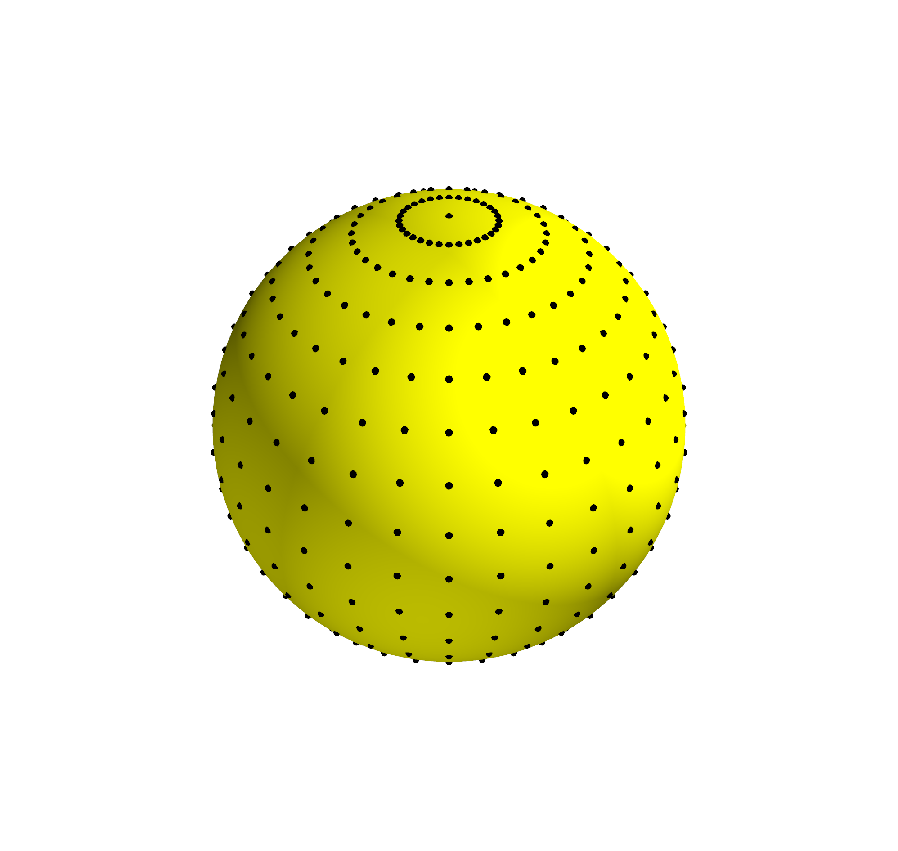
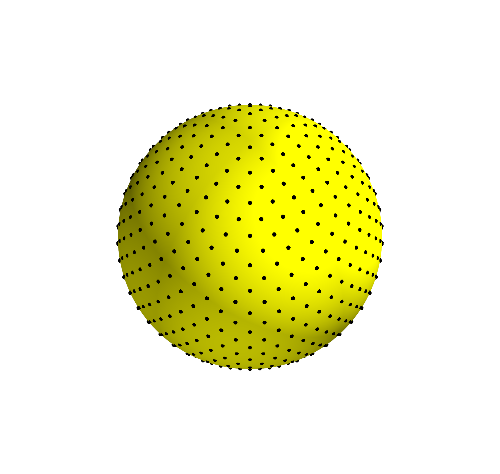
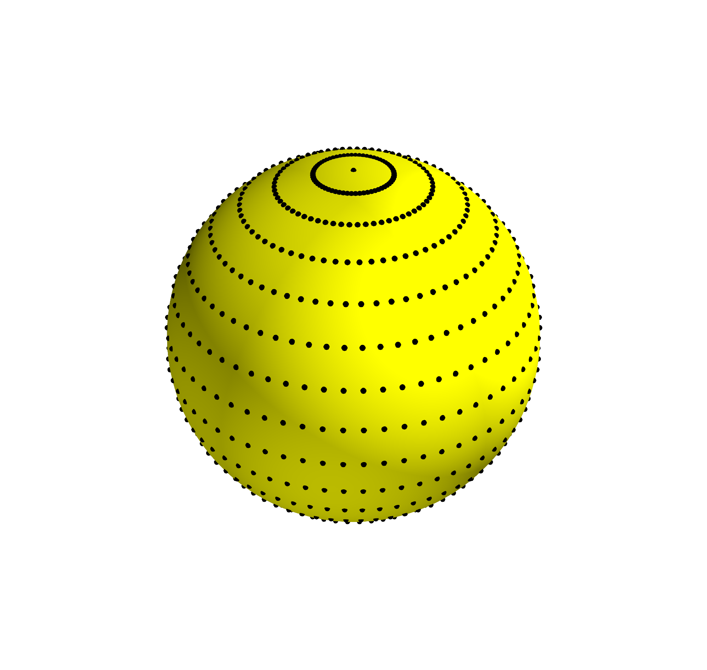
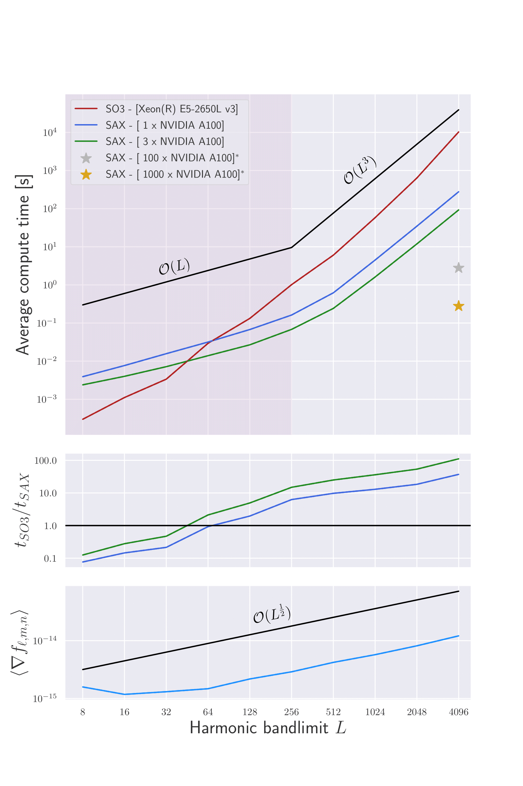
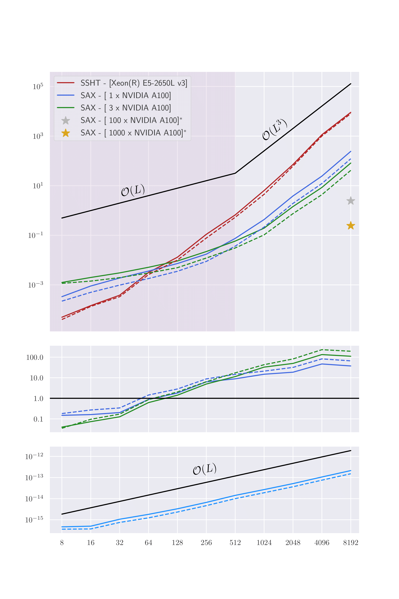

.. image:: https://img.shields.io/badge/GitHub-S2FFT-blue.svg?style=flat
    :target: https://github.com/astro-informatics/s2fft
.. image:: https://github.com/astro-informatics/s2fft/actions/workflows/tests.yml/badge.svg?branch=main
    :target: https://github.com/astro-informatics/s2fft/actions/workflows/tests.yml
.. image:: https://readthedocs.org/projects/ansicolortags/badge/?version=latest
    :target: https://astro-informatics.github.io/s2fft
.. image:: https://codecov.io/gh/astro-informatics/s2fft/branch/main/graph/badge.svg?token=7QYAFAAWLE
    :target: https://codecov.io/gh/astro-informatics/s2fft
.. image:: https://img.shields.io/badge/License-MIT-yellow.svg
    :target: https://opensource.org/licenses/MIT
.. image:: http://img.shields.io/badge/arXiv-xxxx.xxxxx-orange.svg?style=flat
    :target: https://arxiv.org/abs/xxxx.xxxxx
.. image:: https://img.shields.io/badge/code%20style-black-000000.svg
    :target: https://github.com/psf/black

|logo| Differentiable and accelerated spherical transforms with JAX
=================================================================================================================

.. |logo| raw:: html

   

A JAX package for Generalised Fast Fourier Transforms (GFFTs) on the sphere and rotation 
group, which is differentiable, and deployable on modern hardware accelerators (GPU & TPUs). 
``S2FFT`` is a core module from the ``SAX`` package, which includes extensions of these transforms 
to accelerated, differentiable, and directional spin-wavelets, ``S2WAV`` on both the 2-sphere 
`McEwen et al 2015 <https://arxiv.org/abs/1509.06749>`_ and 3-ball 
`Price & McEwen 2021 <https://arxiv.org/abs/2105.05518>`_.

Overview
---------
``S2FFT`` is a software package which provides support for Generalised Fast Fourier Transforms 
on the sphere and the rotation group. Leveraging the highly engineered Price-McEwen 
Wigner-d recursions our transforms exhibit a highly parallelisable algorithmic structure, 
and are theoretically indefinitely numerically stable; certainly far beyond :math:`L > 20,000` although 
64bit floating point errors will begin to accumulate eventually. Moreover, these JAX transforms 
are not only automatically differentiable and deployable on accelerators (GPU & TPUs), but they 
are also sampling agnostic; all that is required are latitudinal samples on the sphere and 
appropriate quadrature weights. As such we support `McEwen-Wiaux <https://arxiv.org/abs/1110.6298>`_, 
`HEALPix <https://healpix.jpl.nasa.gov>`_, and `Driscoll-Healy <https://www.sciencedirect.com/science/article/pii/S0196885884710086>`_ 
in addition to various other discretisations of the sphere.

    **NOTE:**
    By construction ``S2FFT`` is straightforward to install, provides support 
    for spin-spherical harmonic and Wigner transforms (over both real and complex signals), 
    with straightforward extensions to adjoint transformations where needed, and comes 
    with various different optimisations from which one may select depending on available 
    resources and desired angular resolution L.

Sampling patterns for McEwen-Wiaux, HEALPix, and Driscoll-Healy respectively, note that of 
the three HEALPix does not provide a sampling theorem, and therefore exhibits approximate 
transforms. However, HEALPix does provide equal-area pixels which is a 
very nice trait when dealing with e.g. per-pixel noise covariances in a scientific 
setting.

Installation :rocket:
------------------------
The Python dependencies for the ``S2FFT`` package are listed in the file 
``requirements/requirements-core.txt`` and will be automatically installed into the 
active python environment by `pip` when running

.. code-block:: bash 

    pip install .        
    
from the root directory of the repository. Unit tests can then be executed to ensure the 
installation was successful by running 

.. code-block:: bash 

    pytest tests/         # for pytest
    tox -e py38           # for tox 

Alternately, one may install ``S2FFT`` directly from `PyPi` although this does not 
facilitate local running of unit tests.

Benchmarking :hourglass_flowing_sand:
-------------------------------------
We benchmarked the spin-spherical harmonic and Wigner transforms provided by this package 
against their contemporaries, in a variety of settings. We consider both complex signals 
(solid lines) and real signals (dashed lines) wherein hermitian symmetry halves memory 
overhead and wall-time. We further consider single-program multiple-data (SPMD) deployment 
of ``S2FFT``, wherein the compute is distributed across multiple GPUs. Below are 
the results for McEwen-Wiaux sampling for the spin-spherical harmonic (left) and 
Wigner transform for azimuthal bandlimit N = 5 (right).

    **NOTE:**
    The silver and gold stars represent projections for deployment of ``S2FFT`` over 
    many nodes of a GPU cluster with 100,1000 GPUs respectively. Due to the trivially 
    parallel design of our internal Wigner-d recursions each harmonic mode and or 
    latitudinal sample may be processed entirely independently. Moreover, for our Wigner 
    transforms each azimuthal mode is also trivially parallelised.

   

These benchmarks are entirely independent from spin number, however some packages have 
highly optimised (so called 'semi-naive') transforms for scalar spherical harmonic transforms 
which may be extended to spin-signals, and therefore Wigner transforms, by repeated applications 
of spin-raising and spin-lowering operators. This process increases their computation time 
linearly in spin-number, and therefore benchmarking in these settings are highly situation 
dependant. In the scalar case (spin = 0), and for a single GPU, we recover very similar 
compute times, whilst for larger spins the improvement roughly grows to that displayed 
above. 

Contributors :hammer:
------------------------
The development of ``S2FFT`` is one aspect of the ``SAX`` collaborative project between 
the Mullard Space Science Laboratory (MSSL) and Advanced Research Computing (ARC), which aims 
to develop accelerated and differentiable spherical transforms to enable ongoing research 
into next-generation informatics techniques on the 2-sphere and rotation group.
Both academic groups are based at University College London (UCL) and this software was, in part, 
funded by a UCL-ARC Open Source Software Sustainability grant. The development group includes: 
`Matthew A. Price <https://cosmomatt.github.io/>`_ (MSSL, PI), 
`Jason D. McEwen <http://www.jasonmcewen.org/>`_ (MSSL, Alan Turing Institute), 
`Matthew Graham <https://matt-graham.github.io>`_ (ARC),
`Sofía Miñano <https://www.linkedin.com/in/sofiaminano/?originalSubdomain=uk>`_ (ARC),
`Devaraj Gopinathan <https://www.linkedin.com/in/devaraj-g/?originalSubdomain=uk>`_ (ARC), 
pictured below left to right.

.. image:: ./docs/assets/authors/graham.jpeg
   :width: 155
   :target: https://matt-graham.github.io

We strongly encourage constributions from any developers that are interested; a simple 
example would be adding support for more spherical sampling patterns!

Attribution
--------------
We provide this code under an MIT open-source licence with the hope that it will be of use 
to a wider community. Should this code be used in any way, we kindly request that the follow 
article is correctly referenced. A BibTeX entry for this reference may look like:

.. code-block:: 

     @article{price:2023:sax, 
        author = {Price, Matthew A and McEwen, Jason D and Graham, Matthew and Miñano-González, Sofía and Gopinathan, Devaraj},
         title = {"Name pending"},
       journal = {ArXiv},
        eprint = {arXiv:0000.00000},
          year = {2023}
     }
License
-------

``S2FFT`` is released under the MIT license (see 
`LICENSE.txt <https://github.com/astro-informatics/s2fft/blob/main/LICENCE.txt>`_).

.. code-block::

     S2FFT
     Copyright (C) 2023 Author names & contributors

     This program is released under the MIT license (see `LICENSE.txt`).
