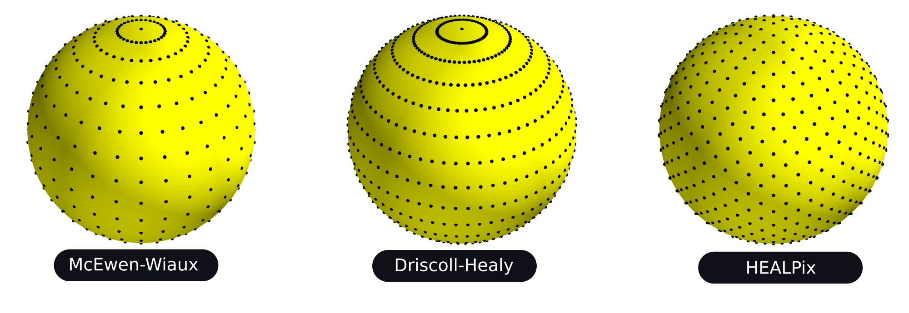

Differentiable and accelerated spherical transforms
===================================================

``S2FFT`` is a JAX package for computing Fourier transforms on the sphere and rotation 
group `(Price & McEwen 2023) <https://arxiv.org/abs/2311.14670>`_.  It leverages autodiff to provide differentiable transforms, which are also 
deployable on modern hardware accelerators (e.g. GPUs and TPUs).

More specifically, ``S2FFT`` provides support for spin spherical harmonic and Wigner
transforms (for both real and complex signals), with support for adjoint transformations
where needed, and comes with different optimisations (precompute or not) that one
may select depending on available resources and desired angular resolution :math:`L`.

Algorithms |:zap:|
-------------------

``S2FFT`` leverages new algorithmic structures that can he highly parallelised and
distributed, and so map very well onto the architecture of hardware accelerators (i.e.
GPUs and TPUs).  In particular, these algorithms are based on new Wigner-d recursions
that are stable to high angular resolution :math:`L`.  The diagram below illustrates the recursions (for further details see Price & McEwen 2023).

.. image:: ./assets/figures/Wigner_recursion_github_docs.png

With this recursion to hand, the spherical harmonic coefficients of an 
isolatitudinally sampled map may be computed as a two step process. First, 
a 1D Fourier transform over longitude, for each latitudinal ring. Second, 
a projection onto the real polar-d functions. One may precompute and store 
all real polar-d functions for extreme acceleration, however this comes 
with an equally extreme memory overhead, which is infeasible at L ~ 1024. 
Alternatively, the real polar-d functions may calculated recursively, 
computing only a portion of the projection at a time, hence incurring 
negligible memory overhead at the cost of slightly slower execution. The 
diagram below illustrates the separable spherical harmonic transform.

.. image:: ./assets/figures/sax_schematic_github_docs.png

.. note::
    For algorithmic reasons JIT compilation of HEALPix transforms can become slow at high bandlimits, due to XLA unfolding of loops which currently cannot be avoided. After compiling HEALPix transforms should execute with the efficiency outlined in the associated paper, therefore this additional time overhead need only be incurred once. We are aware of this issue and will work to improve this in subsequent versions.

Sampling |:earth_africa:|
-----------------------------------

The structure of the algorithms implemented in ``S2FFT`` can support any isolattitude sampling scheme.  A number of sampling schemes are currently supported.

The equiangular sampling schemes of `McEwen & Wiaux (2012) <https://arxiv.org/abs/1110.6298>`_ and `Driscoll & Healy (1995) <https://www.sciencedirect.com/science/article/pii/S0196885884710086>`_ are supported, which exhibit associated sampling theorems and so harmonic transforms can be computed to machine precision.  Note that the McEwen & Wiaux sampling theorem reduces the Nyquist rate on the sphere by a factor of two compared to the Driscoll & Healy approach, halving the number of spherical samples required. 

The popular `HEALPix <https://healpix.jpl.nasa.gov>`_ sampling scheme (`Gorski et al. 2005 <https://arxiv.org/abs/astro-ph/0409513>`_) is also supported.  The HEALPix sampling does not exhibit a sampling theorem and so the corresponding harmonic transforms do not achieve machine precision but exhibit some error.  However, the HEALPix sampling provides pixels of equal areas, which has many practical advantages.
    

Contributors ✨
-----------------------------------

Thanks goes to these wonderful people (`emoji
key <https://allcontributors.org/docs/en/emoji-key>`_):

.. raw:: html 

    <embed>
        <table>
        <tbody>
            <tr>
            <td align="center" valign="top" width="16.66%"><a href="https://cosmomatt.github.io"> <b>Matt Price</b></a> <a href="https://github.com/astro-informatics/s2fft/commits?author=CosmoMatt" title="Code">💻</a> <a href="https://github.com/astro-informatics/s2fft/pulls?q=is%3Apr+reviewed-by%3ACosmoMatt" title="Reviewed Pull Requests">👀</a> <a href="#ideas-CosmoMatt" title="Ideas, Planning, & Feedback">🤔</a></td>
            <td align="center" valign="top" width="16.66%"><a href="http://www.jasonmcewen.org"> <b>Jason McEwen </b></a> <a href="https://github.com/astro-informatics/s2fft/commits?author=jasonmcewen" title="Code">💻</a> <a href="https://github.com/astro-informatics/s2fft/pulls?q=is%3Apr+reviewed-by%3Ajasonmcewen" title="Reviewed Pull Requests">👀</a> <a href="#ideas-jasonmcewen" title="Ideas, Planning, & Feedback">🤔</a></td>
            <td align="center" valign="top" width="16.66%"><a href="http://matt-graham.github.io"> <b>Matt Graham</b></a> <a href="https://github.com/astro-informatics/s2fft/commits?author=matt-graham" title="Code">💻</a> <a href="https://github.com/astro-informatics/s2fft/pulls?q=is%3Apr+reviewed-by%3Amatt-graham" title="Reviewed Pull Requests">👀</a></td>
            <td align="center" valign="top" width="16.66%"><a href="https://sfmig.github.io/"> <b>sfmig</b></a> <a href="https://github.com/astro-informatics/s2fft/commits?author=sfmig" title="Code">💻</a> <a href="https://github.com/astro-informatics/s2fft/pulls?q=is%3Apr+reviewed-by%3Asfmig" title="Reviewed Pull Requests">👀</a></td>
            <td align="center" valign="top" width="16.66%"><a href="https://github.com/Devaraj-G"> <b>Devaraj Gopinathan</b></a> <a href="https://github.com/astro-informatics/s2fft/commits?author=Devaraj-G" title="Code">💻</a></td>
            <td align="center" valign="top" width="16.66%"><a href="http://flanusse.net"> <b>Francois Lanusse</b></a> <a href="https://github.com/astro-informatics/s2fft/commits?author=EiffL" title="Code">💻</a> <a href="https://github.com/astro-informatics/s2fft/issues?q=author%3AEiffL" title="Bug reports">🐛</a></td>
            </tr>
        </tbody>
        </table>
    </embed>

We encourage contributions from any interested developers. A simple
first addition could be adding support for more spherical sampling
patterns!

Attribution |:books:|
------------------

Should this code be used in any way, we kindly request that the following
article is referenced. A BibTeX entry for this reference may look like:

.. code-block:: 

    @article{price:s2fft, 
        author      = "Matthew A. Price and Jason D. McEwen",
        title       = "Differentiable and accelerated spherical harmonic and Wigner transforms",
        journal     = "Journal of Computational Physics, submitted",
        year        = "2023",
        eprint      = "arXiv:2311.14670"        
    }

You might also like to consider citing our related papers on which this code builds:

.. code-block:: 

    @article{mcewen:fssht,
        author      = "Jason D. McEwen and Yves Wiaux",
        title       = "A novel sampling theorem on the sphere",
        journal     = "IEEE Trans. Sig. Proc.",
        year        = "2011",
        volume      = "59",
        number      = "12",
        pages       = "5876--5887",        
        eprint      = "arXiv:1110.6298",
        doi         = "10.1109/TSP.2011.2166394"
    }

.. code-block::
   
    @article{mcewen:so3,
        author      = "Jason D. McEwen and Martin B{\"u}ttner and Boris ~Leistedt and Hiranya V. Peiris and Yves Wiaux",
        title       = "A novel sampling theorem on the rotation group",
        journal     = "IEEE Sig. Proc. Let.",
        year        = "2015",
        volume      = "22",
        number      = "12",
        pages       = "2425--2429",
        eprint      = "arXiv:1508.03101",
        doi         = "10.1109/LSP.2015.2490676"     
    }

License |:memo:|
----------------

We provide this code under an MIT open-source licence with the hope that it will be of use 
to a wider community. 

Copyright 2023 Matthew Price, Jason McEwen and contributors.

``S2FFT`` is free software made available under the MIT License. For details see
the LICENSE file.

.. bibliography:: 
    :notcited:
    :list: bullet

.. * :ref:`modindex`

.. toctree::
   :hidden:
   :maxdepth: 2
   :caption: User Guide

   user_guide/install

.. toctree::
   :hidden:
   :maxdepth: 3
   :caption: Interactive Tutorials
   
   tutorials/index

.. toctree::
   :hidden:
   :maxdepth: 3
   :caption: API

   api/index

