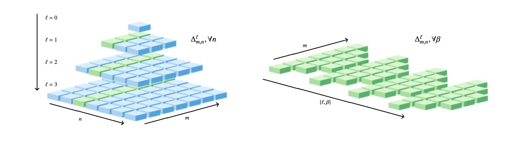

Differentiable and accelerated spherical transforms
===================================================

``S2FFT`` is a software package which provides support for Generalised Fast Fourier Transforms 
on the sphere and the rotation group. Leveraging the highly engineered Price-McEwen 
Wigner-d recursions our transforms exhibit a highly parallelisable algorithmic structure, 
and are theoretically indefinitely numerically stable; certainly far beyond :math:`L > 20,000` although 
64bit floating point errors will begin to accumulate eventually. 

Moreover, these JAX transforms are not only automatically differentiable and deployable on 
accelerators (GPU & TPUs), but they are also sampling agnostic; all that is required are 
latitudinal samples on the sphere and appropriate quadrature weights. As such we support 
`McEwen-Wiaux <https://arxiv.org/abs/1110.6298>`_, `HEALPix <https://healpix.jpl.nasa.gov>`_, 
and `Driscoll-Healy <https://www.sciencedirect.com/science/article/pii/S0196885884710086>`_ 
in addition to various other discretisations of the sphere.

    **NOTE:**
    By construction ``S2FFT`` is straightforward to install, provides support 
    for spin-spherical harmonic and Wigner transforms (over both real and complex signals), 
    with straightforward extensions to adjoint transformations where needed, and comes 
    with various different optimisations from which one may select depending on available 
    resources and desired angular resolution L.

.. image:: ./assets/figures/mwss_sampling_16.png
   :width: 258
   :target: https://arxiv.org/abs/1110.6298

.. image:: ./assets/figures/healpix_sampling_16.png
   :width: 258
   :target: https://arxiv.org/abs/astro-ph/0409513

.. image:: ./assets/figures/dh_sampling_16.png
   :width: 258
   :target: https://www.sciencedirect.com/science/article/pii/S0196885884710086

Sampling patterns for McEwen-Wiaux, HEALPix, and Driscoll-Healy respectively, note that of 
the three HEALPix does not provide a sampling theorem, and therefore exhibits approximate 
transforms. However, HEALPix does provide equal-area pixels which is a 
very nice trait when dealing with e.g. per-pixel noise covariances in a scientific 
setting.

Benchmarking 
------------
We benchmarked the spin-spherical harmonic and Wigner transforms provided by this package 
against their contemporaries, in a variety of settings. We consider both complex signals 
(solid lines) and real signals (dashed lines) wherein hermitian symmetry halves memory 
overhead and wall-time. We further consider single-program multiple-data (SPMD) deployment 
of ``S2FFT``, wherein the compute is distributed across multiple GPUs. Below are 
the results for McEwen-Wiaux sampling for the spin-spherical harmonic (left) and 
Wigner transform for azimuthal bandlimit N = 5 (right).

+------+-----------+-----------+----------+-----------+----------+----------+---------+
|      |       Recursive Algorithm        |       Precompute Algorithm                |
+------+-----------+-----------+----------+-----------+----------+----------+---------+
| L    | Wall-Time | Speed-up  | Error    | Wall-Time | Speed-up | Error    | Memory  |
+------+-----------+-----------+----------+-----------+----------+----------+---------+
| 64   | 3.6 ms    | 0.88      | 1.81E-15 | 52.4 μs   | 60.5     | 1.67E-15 | 4.2 MB  |
+------+-----------+-----------+----------+-----------+----------+----------+---------+
| 128  | 7.26 ms   | 1.80      | 3.32E-15 | 162 μs    | 80.5     | 3.64E-15 | 33 MB   |
+------+-----------+-----------+----------+-----------+----------+----------+---------+
| 256  | 17.3 ms   | 6.32      | 6.66E-15 | 669 μs    | 163      | 6.74E-15 | 268 MB  |
+------+-----------+-----------+----------+-----------+----------+----------+---------+
| 512  | 58.3 ms   | 11.4      | 1.43E-14 | 3.6 ms    | 184      | 1.37E-14 | 2.14 GB |
+------+-----------+-----------+----------+-----------+----------+----------+---------+
| 1024 | 194 ms    | 32.9      | 2.69E-14 | 32.6 ms   | 195      | 2.47E-14 | 17.1 GB |
+------+-----------+-----------+----------+-----------+----------+----------+---------+
| 2048 | 1.44 s    | 49.7      | 5.17E-14 | N/A       | N/A      | N/A      | N/A     |
+------+-----------+-----------+----------+-----------+----------+----------+---------+
| 4096 | 8.48 s    | 133.9     | 1.06E-13 | N/A       | N/A      | N/A      | N/A     |
+------+-----------+-----------+----------+-----------+----------+----------+---------+
| 8192 | 82 s      | 110.8     | 2.14E-13 | N/A       | N/A      | N/A      | N/A     |
+------+-----------+-----------+----------+-----------+----------+----------+---------+

These benchmarks are entirely independent from spin number, however some packages have 
highly optimised (so called 'semi-naive') transforms for scalar spherical harmonic transforms 
which may be extended to spin-signals, and therefore Wigner transforms, by repeated applications 
of spin-raising and spin-lowering operators. This process increases their computation time 
linearly in spin-number, and therefore benchmarking in these settings are highly situation 
dependant. In the scalar case (spin = 0), and for a single GPU, we recover very similar 
compute times, whilst for larger spins the improvement roughly grows to that displayed 
above. 

Contributors
--------------
The development of ``S2FFT`` is one aspect of the ``SAX`` collaborative project between 
the Mullard Space Science Laboratory (MSSL) and Advanced Research Computing (ARC), which aims 
to develop accelerated and differentiable spherical transforms to enable ongoing research 
into next-generation informatics techniques on :math:`\mathbb{S}^2` and SO(3).
Both academic groups are based at University College London (UCL) and this software was, in part, 
funded by a UCL-ARC Open Source Software Sustainability grant. The development group includes: 
`Matthew A. Price <https://cosmomatt.github.io/>`_ (MSSL, PI), 
`Jason D. McEwen <http://www.jasonmcewen.org/>`_ (MSSL, Alan Turing Institute), 
`Matthew Graham <https://matt-graham.github.io>`_ (ARC),
`Sofía Miñano <https://www.linkedin.com/in/sofiaminano/?originalSubdomain=uk>`_ (ARC),
`Devaraj Gopinathan <https://www.linkedin.com/in/devaraj-g/?originalSubdomain=uk>`_ (ARC), 
pictured below left to right.

.. image:: assets/authors/price.jpeg
   :width: 155
   :target: https://cosmomatt.github.io/

.. image:: assets/authors/mcewen.jpeg
   :width: 155
   :target: http://www.jasonmcewen.org/

.. image:: assets/authors/graham.jpeg
   :width: 155
   :target: https://matt-graham.github.io

.. image:: assets/authors/minano.jpeg
   :width: 155
   :target: https://www.linkedin.com/in/sofiaminano/?originalSubdomain=uk

.. image:: assets/authors/gopinathan.jpeg
   :width: 155
   :target: https://www.linkedin.com/in/devaraj-g/?originalSubdomain=uk

We strongly encourage constributions from any developers that are interested; a simple 
example would be adding support for more spherical sampling patterns!

Attribution
--------------

We provide this code under an MIT open-source licence with the hope that it will be of use 
to a wider community. Should this code be used in any way, we kindly request that the follow 
article is correctly referenced. A BibTeX entry for this reference may look like:

.. code-block:: 

     @article{price:2023:sax, 
        author = {Price, Matthew A and McEwen, Jason D},
         title = {'TBA'},
       journal = {ArXiv},
        eprint = {arXiv:0000.00000},
          year = {2023}
     }

.. bibliography:: 
    :notcited:
    :list: bullet

.. * :ref:`modindex`

.. toctree::
   :hidden:
   :maxdepth: 2
   :caption: User Guide

   user_guide/install

.. toctree::
   :hidden:
   :maxdepth: 2
   :caption: Interactive Tutorials
   
   tutorials/example_notebook.nblink

.. toctree::
   :hidden:
   :maxdepth: 3
   :caption: API

   api/index

